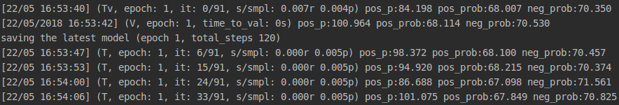
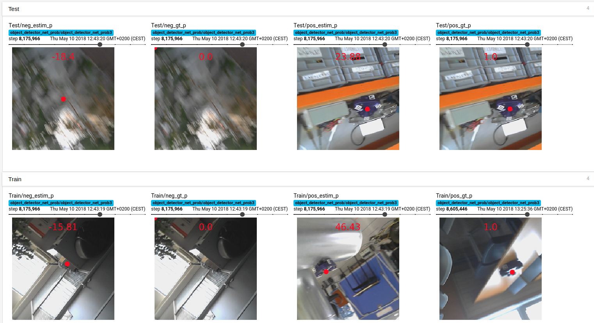

# Pytorch Tutorial - Simple Object Detector

Repo for new students willing to learn Pytorch. It implements a simple object detector.

### Prerequisites
To understand the repo I recommend first doing the official Pytorch [Beginner Tutorials](http://pytorch.org/tutorials/).

### Dependencies
Apart from PyTorch and Tensorboard:
```
pip install -r requirements.txt
```

### Train/Test Example
Train: (dataset is automatically downloaded)
```
bash launch/run_train.sh
```
Test:
```
python test.py
```

### Monitor
Terminal:


Tensorboard:
```
tensorboard --logdir ./checkpoints
```



### Contact
For any doubt or upgrade contact `albert.pumarola.peris at gmail.com`
